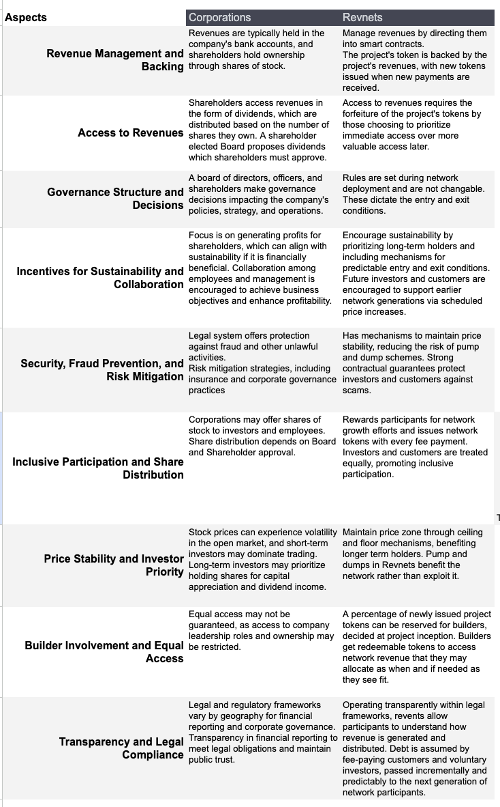

# Comparing Corporations with Revnets

_by Kmac – originally shared on
[kmacb.eth.limo](https://kmacb.eth.limo/81C59C18-70C0-4780-834F-F6EAAA9D593A/)_

Revnets are not a replacement for corporations but rather a complement. They may
serve as a rewards or loyalty point system for corporations, or they can
function as independent treasuries without the need for a formal entity.
