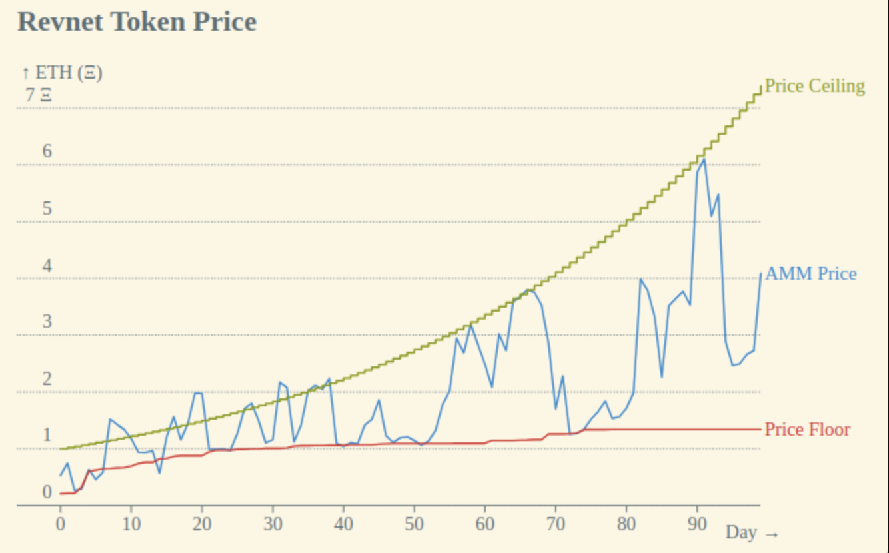

# Pitch

_by Jango – originally shared on
[revnet.eth.limo](https://revnet.eth.limo/?id=4211056F-95FA-4459-9D53-ABC9E72ABB73)_

#### Revnets are revenue-backed up-only networks, great for funding and sustaining open source projects and internet networks.

## State of Internet Business

#### Open source software and openly accounted-for businesses should outcompeting everything.

- **Scaled Collaboration:** Global community accelerates experimentation,
  leading to more innovation.

- **Full Transparency:** Public code and accounting is more trustworthy.

- **Cost Effeciency:** Many managerial expenses are not needed when there are no
  secrets or artificial barriers to progress.

## Problem

#### Open source struggles to enforce revenue-generation to pay for innovation, maintenance, and growth, making its development reliant on free and inconsistent labor, donations, grants, or corporate sponsorship.

- **Monetization Dilemma:** Generating scalable and unilateral revenue while
  keeping information openly copiable is fragile since extracting profit margins
  encourage the use of alternatives.

- **Value Dilemma:** Conventional models fail to adequately and consistently
  reward all contributors, reducing incentive to participate on all fronts.

- **Dependency Dilemma:** Many profitable businesses rely deeply on open source
  components, yet don't have clarity on how to foster a productive financial
  relationship with its community, or motivation to do so unless developed
  in-house.

## Solution

#### Revnets: A win-win-win openly-accounted-for growth model, for investors, builders, and retail customers of open source and beyond. Powered by the Juicebox and Uniswap protocols on Ethereum.

- **Networks matter:** The value around open source projects is created by the
  community of supporters that invest, build, and use them. Revnets take
  everyone's contribution into account, providing a structured yet open way to
  sustain the project's growth.

- **Revenue matters:** People prefer to pay for and help projects when they love
  what it stands for and benefit from its growth. Revnets encourage the
  community to capture revenue, creating a self-fueling economy around the
  project.

- **Growth matters**: With each generation of investors, builders, and users
  building upon the last, revnets are a predictable and self-propagating growth
  model.

- **Incentives matter**: As a structured revenue-backed growth model, revnets
  incentivize contributions from investors, builders, and users while providing
  clarity around ongoing financial relationships, making the open-source project
  more community-owned and less dependent on inconsistent external funding.

## How It Works

1. **Investment & Revenue Capture:** When revnets take in money, they issue out
   an option on that money to the payer, and possibly a little to a builder.
   This means each payer receives a rebate that increases in value as the
   network grows or shrinks.

2. **Scheduled Option Issuance:** Fewer of these options get issued over time
   relative to the amount of money paid in, on a fixed schedule. This
   acknowledges the risks and contributions of earlier participants, increasing
   the value of existing options as new money comes in.

3. **Option Exercise & Value Appreciation:** When the option is exercised, the
   remaining options become more valuable as the total pool of available options
   decreases more than the amount claimed from the revnet. The revnet's money
   can only be accessed via these options, ensuring controlled access to the
   funds for those who need immediacy, while incentivizing patience and growth
   for everyone else.

4. **Market Dynamics:** As liquidity is created, the options can be traded on
   exchanges, creating a market window between the ever-increasing price ceiling
   created by the price of issuing new options, and the ever-increasing price
   floor created by the value of exercising options. This market dynamic
   provides a bounded-but-tangible value proposition for initial and future
   investors, builders, and users.

A revnet's fiscal policy results in the chart shown above. There are only few
immutable parameters tuned when a revnet is deployed which determine the rate of
price ceiling increases as the issuance of options decreases, and the intensity
of price floor increases as options are exercised. Play with simulations at
[sim.revnet.app](https://sim.revnet.app).

[Learn more about how revnets work](https://revnet.eth.limo/about)

## Why Bet On Revnets

Revnets tie the act of paying for a public product to both a moral and financial
incentive. By paying into the revnet, individuals not only fulfill a required or
voluntary debt to the project and its supporting community, they also create a
means of benefiting from future payment. This dual incentive structure motivates
communities to support its own growth instead of opting for free alternatives
that struggle to find sustainability.

Revnets are a clear, tangible, and equitable financial structure that address
the long-standing monetization dilemma in open source, built specifically as an
attractive model for networks of investors, builders, and fee-paying consumers
alike.

## Getting Involved

$REV specifications and information about the first season of revnets that'll be
live on [revnet.app](https://revnet.app) are available
[here](https://revnet.eth.limo/about/).
